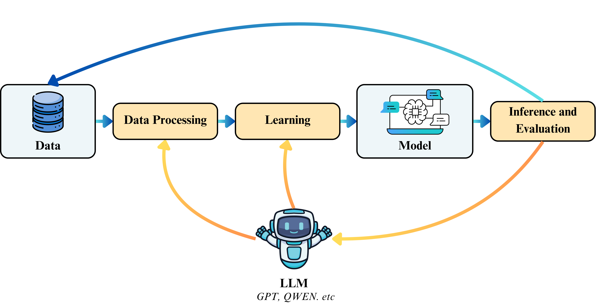

---

##### Abstract

Building on the success of human-in-the-loop, where human wisdom is integrated into the development of machine learning algorithms, we take the initiative to envision an innovative and promising paradigm, LLM-in-the-loop (LLM-ITL), which leverages the unique advantages of LLMs to replicate human involvement and offer a more flexible and cost-efficient solution to real-world challenges. Through a comprehensive review of LLM research from 2020 to 2025, we reveal that many existing LLM applications inherently align with LLM-ITL, with researchers rapidly claiming their superiority over machine learning baselines and LLM-native solutions; however, no universal definition exists, hindering its further advancement and application. In this paper, we define and categorize LLM-ITL methodologies for data, model, and task-centric applications, discuss their underlying rationale, and highlight emerging areas where LLMs can be further integrated into the loop. Furthermore, we present opportunities for developing better LLM-ITL solutions with technical advancements, such as LLM crowdsourcing and text-to-solution, establishing the proposed paradigm as a promising avenue for the future of LLM applications and machine learning research. [[Paper]](llm-itl.pdf) [[Code and Data]](https://github.com/mengze-hong/LLM-in-the-loop)



---

##### Citation

```bibtex
@article{hong2025llm,
  title={LLM-in-the-Loop: Replicating Human Insight with LLMs for Better Machine Learning Applications},
  author={Hong, Mengze and Ng, Wailing and Zhang, Chen Jason and Jiang, Di},
  journal={Authorea Preprints},
  year={2025},
  publisher={Authorea}
}
```