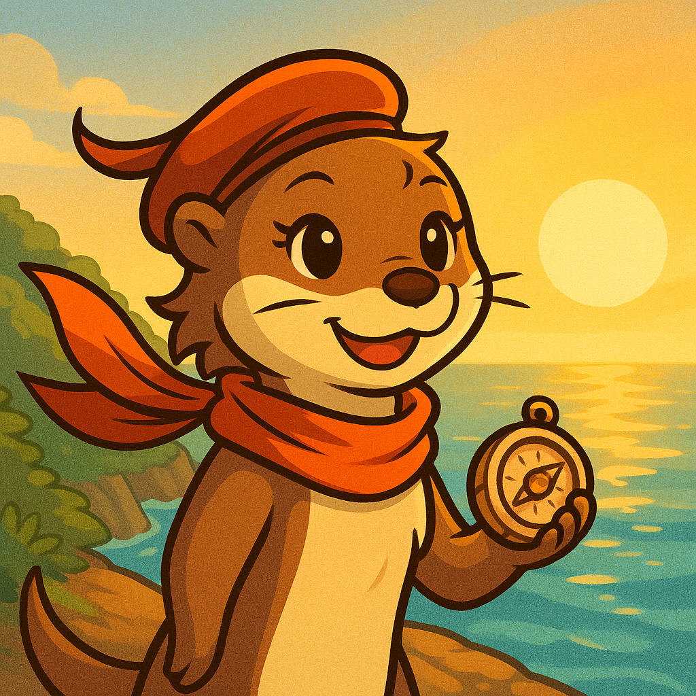

  

<h2 class="title-accent">We are otterstanding! 💪💪</h2>

<section class="people-group">
  <h3>Alpha Otter ⭐</h3>
  

    <figure class="person">
      
      <figcaption>Meng</figcaption>
    </figure>
    <figure class="person">
      
      <figcaption>Travis</figcaption>
    </figure>
  

</section>

<section class="people-group">
  <h3>Sea Otter 🌊</h3>
  

    <figure class="person">
      
      <figcaption>Steve</figcaption>
    </figure>
  

</section>

<section class="people-group">
  <h3>River Otter 🦦</h3>
  

    <figure class="person">
      
      <figcaption>Mark</figcaption>
    </figure>
    <figure class="person">
      
      <figcaption>Wennie</figcaption>
    </figure>
    <figure class="person">
      
      <figcaption>Wong</figcaption>
    </figure>
  

</section>

<section class="people-group">
  <h3>Pup Otter 🍼</h3>
  

    <figure class="person">
      
      <figcaption>Luna</figcaption>
    </figure>
    <figure class="person">
      
      <figcaption>Marina</figcaption>
    </figure>
  

</section>

---

<h2 class="title-accent">Waiting for you ✨</h2>

  

